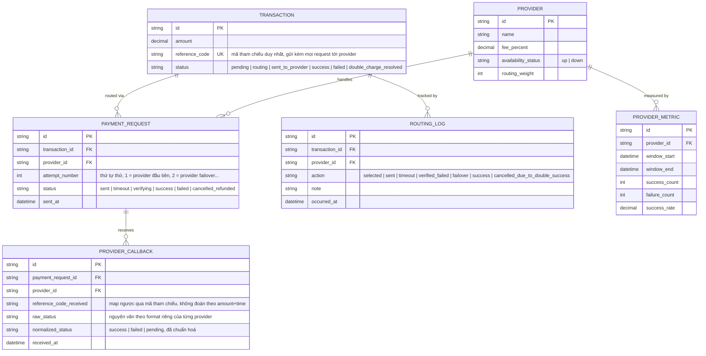

# Enhance ERD — Thêm mã tham chiếu, log routing, chuẩn hoá callback và metric dashboard

Đây là **enhance**, mô hình dữ liệu sau khi áp các cơ chế an toàn lên base. So với base: `TRANSACTION` thêm `reference_code` unique (mã tham chiếu gửi kèm mọi request tới provider, dùng để map ngược callback thay vì đoán theo amount+time) và trạng thái `routing` được chuyển bằng update nguyên tử có điều kiện. `PAYMENT_REQUEST` thêm `attempt_number` và trạng thái `verifying`/`cancelled_refunded` cho luồng xác minh trước failover và huỷ/hoàn tiền khi double-success. Thêm mới `PROVIDER_CALLBACK` — chuẩn hoá mọi callback (dù format gốc khác nhau) về cùng 1 mô hình trạng thái nội bộ, map lại `PAYMENT_REQUEST` qua `reference_code`. Thêm mới `ROUTING_LOG` — log đầy đủ lịch sử routing của từng giao dịch. Thêm mới `PROVIDER_METRIC` — số liệu thành công/lỗi real-time theo từng nhà cung cấp phục vụ dashboard và tự động điều chỉnh tỷ lệ routing.

