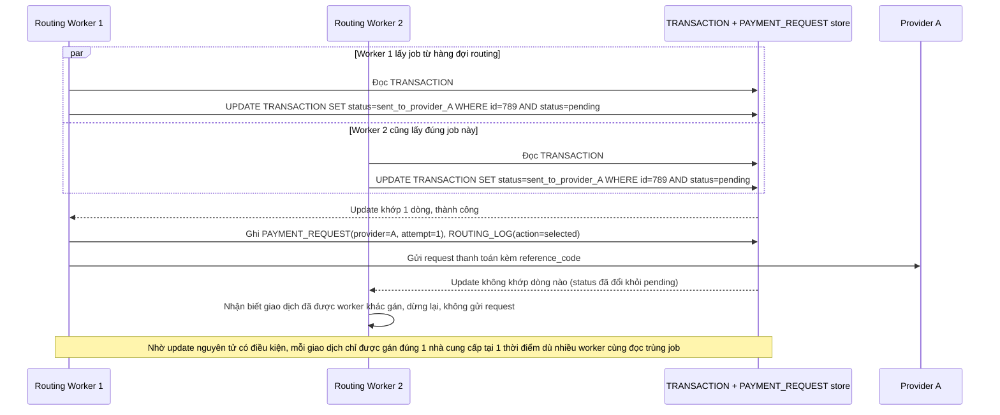

# Enhance sequence — Chọn nhà cung cấp và gửi giao dịch (atomic lock)

Đây là **enhance**, flow "Định tuyến và gửi giao dịch tới nhà cung cấp" sau khi có update nguyên tử có điều kiện. So với base, flow này thay đổi ở chỗ chuyển trạng thái `pending → routing → sent_to_provider_A` bằng 1 câu update nguyên tử có điều kiện (`WHERE status = pending`), nên khi 2 worker cùng lấy nhầm 1 job, chỉ đúng 1 worker update thành công, worker còn lại nhận biết giao dịch đã bị worker khác xử lý và dừng lại — không gửi trùng request.

