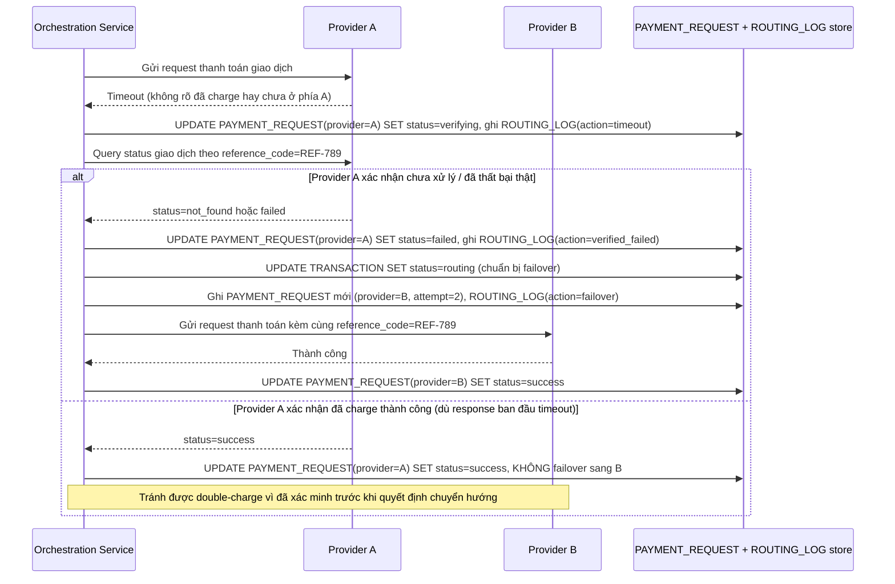

# Enhance sequence — Timeout ở A: xác minh trạng thái trước khi failover sang B

Đây là **enhance**, flow "Timeout khi gửi thanh toán, chuyển sang nhà cung cấp khác" sau khi có bước xác minh bắt buộc. So với base, flow này thay đổi ở chỗ khi request tới Provider A timeout, hệ thống **không** gửi ngay request y hệt sang Provider B — mà trước tiên gọi API query status của A, hoặc đợi đủ khoảng thời gian timeout xác định trước, rồi mới coi là thất bại thật và failover, tránh nguy cơ charge tiền khách ở cả A và B.

