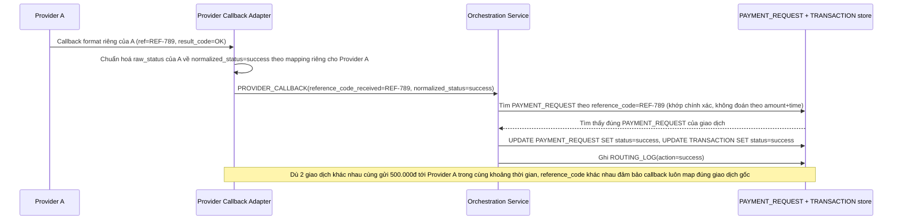

# Enhance sequence — Chuẩn hoá callback và map lại giao dịch qua reference_code

Đây là **enhance**, flow "Nhận callback từ nhà cung cấp" sau khi có chuẩn hoá và mã tham chiếu. So với base, flow này thay đổi ở 2 điểm: (1) mọi callback dù format gốc khác nhau đều được adapter theo từng provider chuyển về cùng 1 `normalized_status` nội bộ trước khi ghi nhận, (2) map lại `PAYMENT_REQUEST`/`TRANSACTION` gốc bằng `reference_code` đã gửi kèm lúc khởi tạo request, không còn đoán theo số tiền + thời gian.

