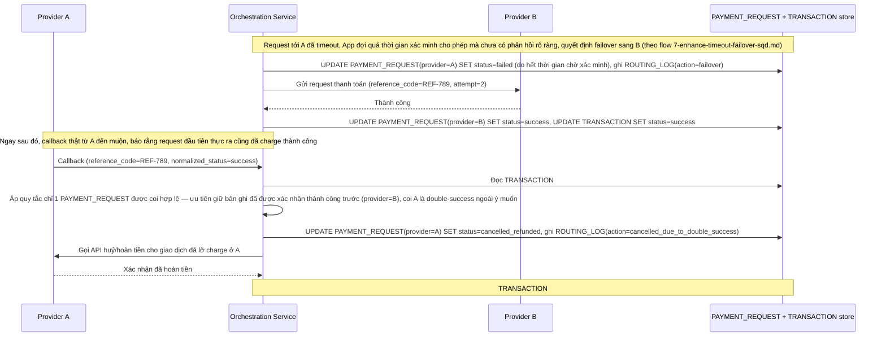

# Enhance sequence — Race giữa callback thất bại thật từ A và failover đã chuyển sang B

Đây là **enhance**, flow mới phát sinh từ enhance — minh hoạ đúng tình huống mô tả cụ thể ở yêu cầu thứ 4: callback thật từ Provider A báo thất bại đến ngay sau khi hệ thống đã quyết định failover sang Provider B do quá thời gian chờ xác minh, và cả 2 vô tình đều thành công. Đảm bảo chỉ 1 trong 2 `PAYMENT_REQUEST` được coi là hợp lệ cuối cùng, phía còn lại bị huỷ/hoàn tiền.

