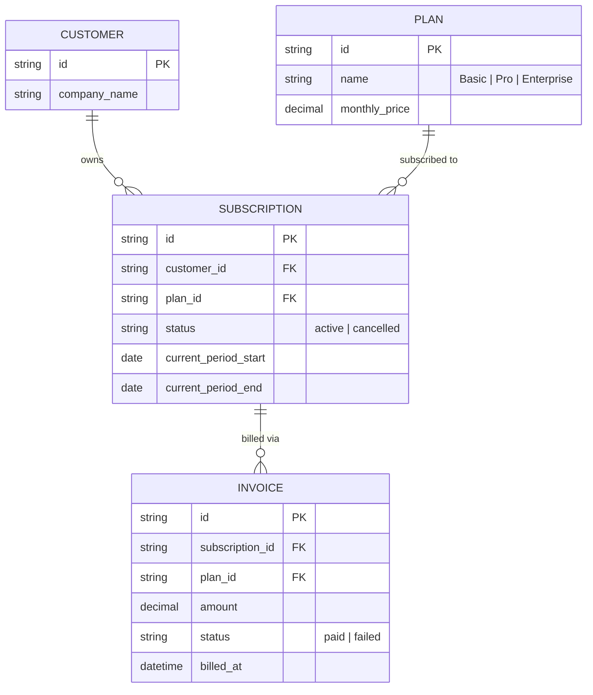

# Base ERD — Subscription billing chưa có lock/version check giữa job và thao tác khách

Đây là **base**: mô hình dữ liệu suy luận từ ngữ cảnh đề bài, thể hiện trạng thái hệ thống **trước khi** có cơ chế lock/version check và idempotency cho job renewal. Đề bài nói tới SaaS B2B tính phí theo subscription hàng tháng, có job billing tự động và khách tự đổi/hủy gói qua UI — nên base cần đủ: khách hàng, gói dịch vụ, subscription gắn 1 gói hiện tại, và hoá đơn mỗi lần charge thành công. Base **chưa có** version/lock trên subscription, chưa có idempotency key cho lần charge, chưa có cơ chế gói chờ hiệu lực chu kỳ sau, chưa có chính sách hoàn tiền theo tỷ lệ — những thứ đó là phần enhance.

