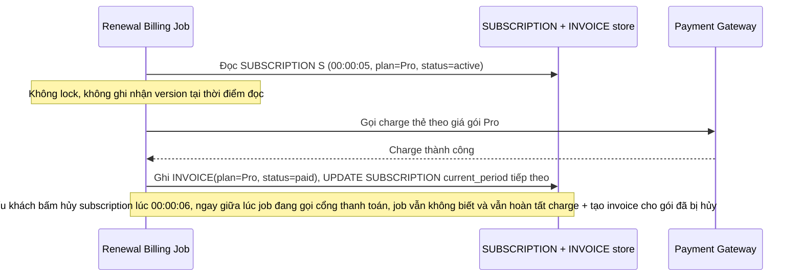

# Base sequence — Job renewal charge thẻ (không lock, không version check)

Đây là **base**, flow "Job billing tự động renewal" ở trạng thái hiện tại — job đọc gói hiện tại của subscription, gọi cổng thanh toán charge theo gói đó, rồi ghi invoice và cập nhật chu kỳ mới, không kiểm tra lại subscription có bị đổi/hủy giữa chừng hay không, không có idempotency key. Flow này liên quan mật thiết tới enhance vì toàn bộ yêu cầu 1, 2 và 5 của đề bài đều nhằm sửa đúng các lỗ hổng race và crash-recovery ở đây.

