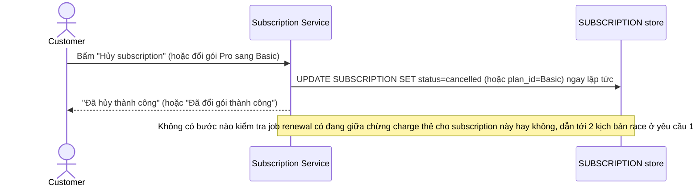

# Base sequence — Khách tự đổi gói/hủy gói qua UI (ghi đè trực tiếp)

Đây là **base**, flow "Khách đổi gói/hủy gói" ở trạng thái hiện tại — khách thao tác qua UI, hệ thống ghi đè thẳng `plan_id`/`status` của subscription ngay lập tức, không biết và không quan tâm job renewal có đang xử lý song song subscription này hay không. Flow này liên quan mật thiết tới enhance vì đây chính là phía còn lại của race điều kiện mà đề bài mô tả ở yêu cầu 1 và 2.

