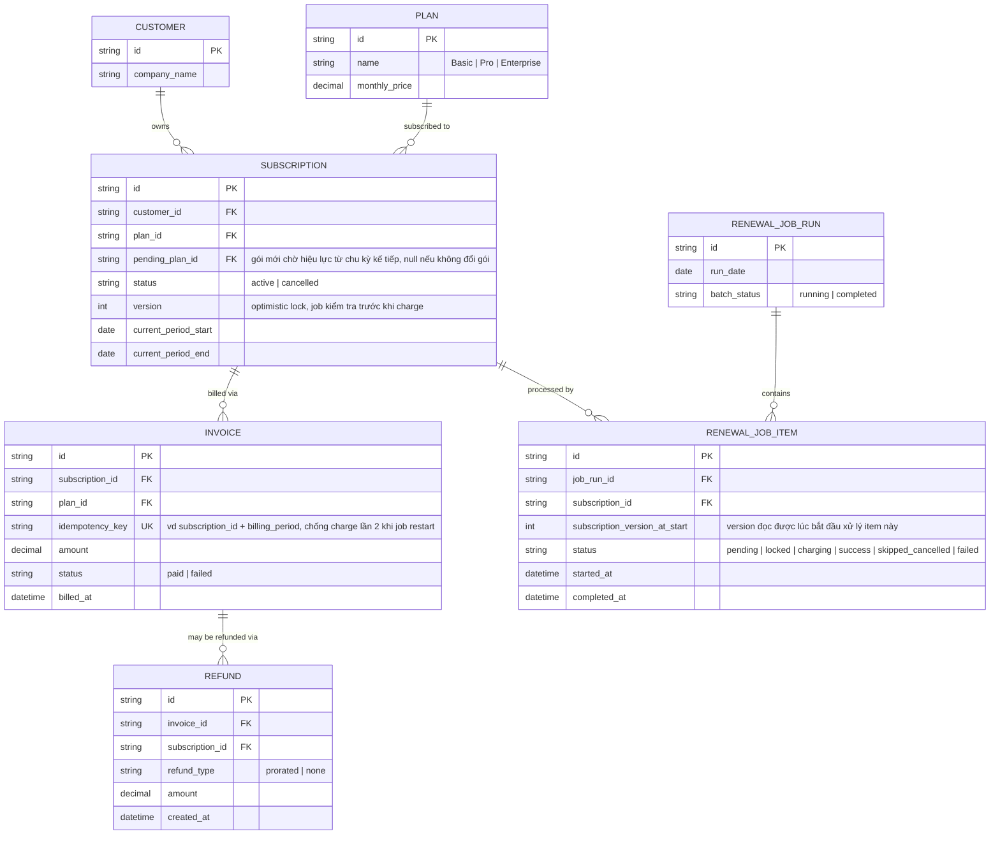

# Enhance ERD — Thêm version lock, idempotency, gói chờ hiệu lực và hoàn tiền theo tỷ lệ

Đây là **enhance**, mô hình dữ liệu sau khi áp cơ chế lock/version check + idempotency lên base. So với base: `SUBSCRIPTION` thêm `version` (optimistic lock, job kiểm tra trước khi charge) và `pending_plan_id` (đổi gói chỉ có hiệu lực từ chu kỳ kế tiếp khi job đang giữa chừng charge). `INVOICE` thêm `idempotency_key` unique theo (subscription_id, kỳ billing) để job restart sau crash không charge lần 2. Thêm mới `RENEWAL_JOB_RUN` + `RENEWAL_JOB_ITEM` — mỗi subscription trong batch được xử lý độc lập với trạng thái/lock riêng, lỗi 1 item không ảnh hưởng item khác. Thêm mới `REFUND` — ghi nhận chính sách hoàn tiền theo tỷ lệ hoặc không hoàn khi khách hủy ngay sau khi đã charge thành công.

