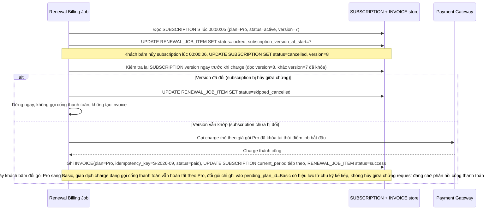

# Enhance sequence — Job renewal với version lock, dừng ngay nếu đã bị hủy

Đây là **enhance**, flow "Job billing tự động renewal" sau khi có version check trước khi charge. So với base, flow này thay đổi ở chỗ: job ghi nhận `version` tại thời điểm đọc subscription, và ngay trước khi gọi cổng thanh toán, job kiểm tra lại version/status 1 lần nữa — nếu subscription đã bị hủy (version thay đổi) thì dừng ngay, không charge, không tạo invoice. Nếu subscription vẫn active tại thời điểm khóa, job tiếp tục charge theo giá đã khóa dù ngay sau đó khách có đổi gói, việc đổi gói chỉ ghi vào `pending_plan_id` để có hiệu lực từ chu kỳ kế tiếp.

