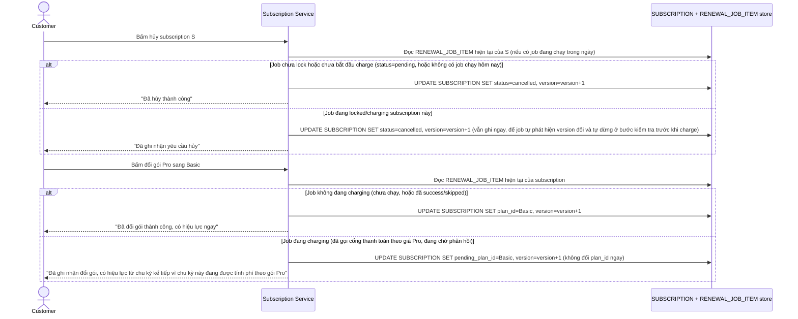

# Enhance sequence — Đổi gói/hủy gói biết trạng thái job renewal đang xử lý

Đây là **enhance**, flow "Khách đổi gói/hủy gói" sau khi phối hợp với version lock của job renewal. So với base (ghi đè trực tiếp không kiểm tra gì), flow này thay đổi ở chỗ: mọi thao tác đổi gói/hủy đều tăng `version` của subscription bất kể job có đang xử lý hay không (đây chính là tín hiệu để job phát hiện thay đổi ở file `5-enhance-renewal-billing-job-sqd.md`); riêng đổi gói (không phải hủy) khi job đang trong lúc `charging` sẽ ghi vào `pending_plan_id` thay vì đổi `plan_id` ngay, để tránh xung đột với giao dịch đang gọi cổng thanh toán.

