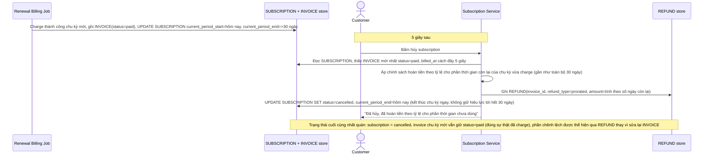

# Enhance sequence — Hủy ngay sau khi charge thành công, áp chính sách hoàn tiền

Đây là **enhance**, flow mới phát sinh từ enhance — khách bấm hủy subscription 5 giây sau khi job billing đã charge thành công chu kỳ mới. Xử lý đúng yêu cầu 3 của đề bài: áp chính sách hoàn tiền theo tỷ lệ (hoặc không hoàn) cho phần thời gian còn lại của chu kỳ, và đảm bảo trạng thái subscription cuối cùng nhất quán, không mâu thuẫn giữa "đã charge chu kỳ mới" và "đã hủy ngay lập tức".

