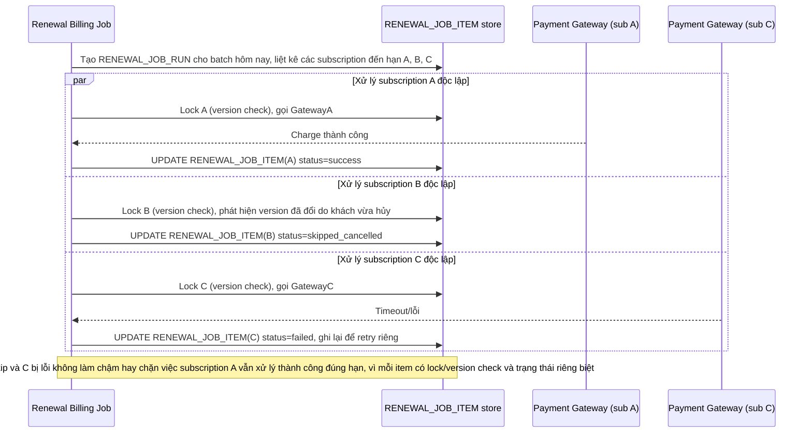

# Enhance sequence — Batch renewal xử lý độc lập, lỗi 1 subscription không lan sang subscription khác

Đây là **enhance**, flow mới phát sinh từ enhance — job renewal chạy hàng loạt cho nhiều subscription đến hạn trong ngày, mỗi subscription là 1 `RENEWAL_JOB_ITEM` độc lập với version lock riêng theo đúng flow ở file `5-enhance-renewal-billing-job-sqd.md`. Xử lý đúng yêu cầu 4 của đề bài: conflict hoặc lỗi ở 1 subscription không làm chậm hoặc ảnh hưởng tới việc xử lý các subscription khác trong cùng batch.

