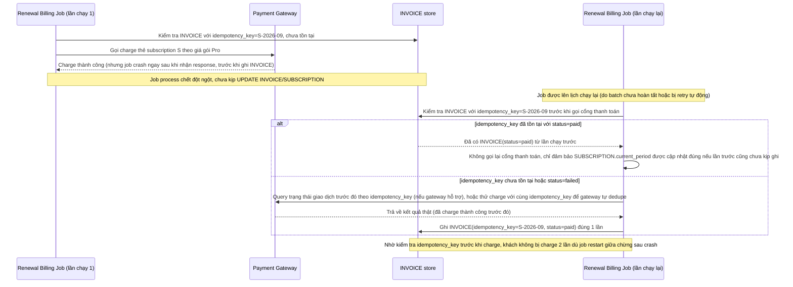

# Enhance sequence — Job crash giữa chừng, restart không charge lần 2

Đây là **enhance**, flow mới phát sinh từ enhance — xử lý đúng yêu cầu 5 của đề bài: job crash ngay sau khi đã charge thành công ở cổng thanh toán nhưng chưa kịp ghi nhận kết quả vào `INVOICE`, lần chạy lại cho cùng subscription trong cùng chu kỳ phải kiểm tra idempotency trước khi gọi cổng thanh toán lại, tránh charge lần 2.

