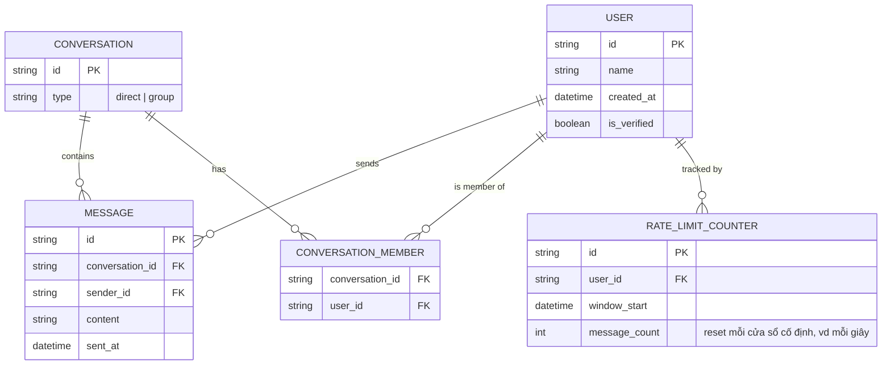

# Base ERD — Chat/group với rate limit ngưỡng cứng cố định

Đây là **base**: mô hình dữ liệu suy luận từ ngữ cảnh đề bài, thể hiện trạng thái hệ thống **trước khi** có thuật toán cho phép burst tự nhiên, phân biệt theo cuộc trò chuyện, phát hiện pattern nội dung, và điều chỉnh theo uy tín tài khoản. Đề bài nói tới ngưỡng rate limit cứng (giới hạn tin/giây cố định) đang gây chặn nhầm user thật — nên base cần đủ: user, cuộc trò chuyện (1-1 hoặc group), tin nhắn, và 1 bộ đếm rate limit đơn giản theo cửa sổ thời gian cố định áp dụng chung cho mọi user, không phân biệt loại cuộc trò chuyện hay uy tín tài khoản. Base **chưa có** token bucket cho phép burst, chưa có policy theo trust level, chưa có phát hiện pattern nội dung lặp lại — những thứ đó là phần enhance.

