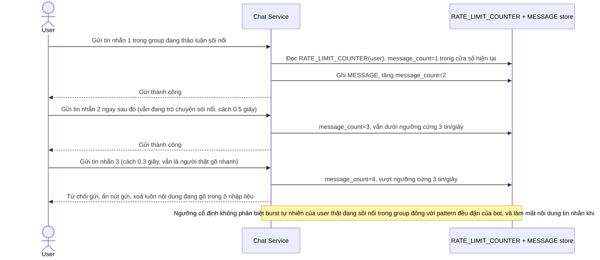

# Base sequence — Gửi tin nhắn với rate limit ngưỡng cứng, chặn nhầm khi gõ dồn dập

Đây là **base**, flow "Gửi tin nhắn" ở trạng thái hiện tại — mỗi lần gửi, app cộng dồn bộ đếm theo cửa sổ thời gian cố định (vd 1 giây) áp dụng chung cho mọi user, không phân biệt gửi trong group đông hay chat 1-1, vượt ngưỡng là chặn ngay và mất luôn nội dung đang gõ. Flow này liên quan mật thiết tới enhance vì toàn bộ 4 yêu cầu của đề bài đều nhằm sửa đúng các hạn chế ở đây.

