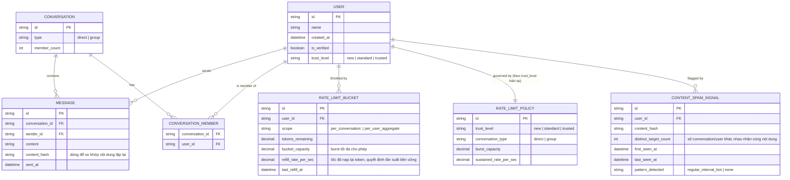

# Enhance ERD — Token bucket theo scope, policy theo trust level, phát hiện pattern nội dung

Đây là **enhance**, mô hình dữ liệu sau khi áp thuật toán rate limit cho phép burst + phân biệt theo cuộc trò chuyện + phát hiện pattern nội dung + policy động theo uy tín tài khoản lên base. So với base: `RATE_LIMIT_COUNTER` (cửa sổ cố định) được thay bằng `RATE_LIMIT_BUCKET` (token bucket cho phép burst ngắn, tách theo `scope` — trong 1 conversation cụ thể hay tổng hợp toàn user). `USER` thêm `trust_level` (suy ra từ tuổi tài khoản + lịch sử hành vi), gắn với `RATE_LIMIT_POLICY` quy định `burst_capacity`/`sustained_rate` khác nhau theo `trust_level` và loại conversation. Thêm mới `CONTENT_SPAM_SIGNAL` — theo dõi nội dung lặp lại gửi tới nhiều đối tượng khác nhau trong thời gian ngắn, phát hiện bot dù tần suất từng tin không vượt ngưỡng cứng.

