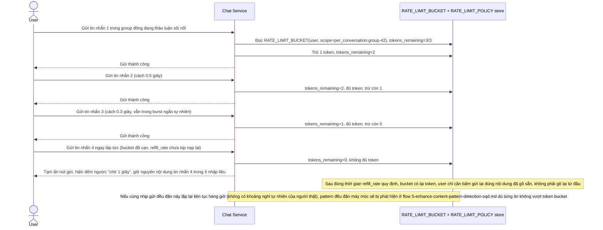

# Enhance sequence — Gửi tin nhắn với token bucket cho phép burst, giữ nguyên nội dung khi bị chặn tạm

Đây là **enhance**, flow "Gửi tin nhắn" sau khi áp token bucket theo scope. So với base (ngưỡng cứng, mất nội dung khi chặn), flow này thay đổi ở 3 điểm: (1) dùng token bucket cho phép burst ngắn (vài tin liên tiếp trong 1-2 giây) miễn còn token, chỉ bắt pattern đều đặn kéo dài khi bucket cạn và refill_rate không theo kịp, (2) scope tách theo conversation (`per_conversation:<id>`) để gửi nhanh trong 1 group đông không tính chung với gửi rải rác tới nhiều người khác, (3) khi bị chặn tạm, chỉ ẩn nút gửi + đếm ngược vài giây, nội dung đang gõ vẫn được giữ nguyên trong ô nhập liệu.

