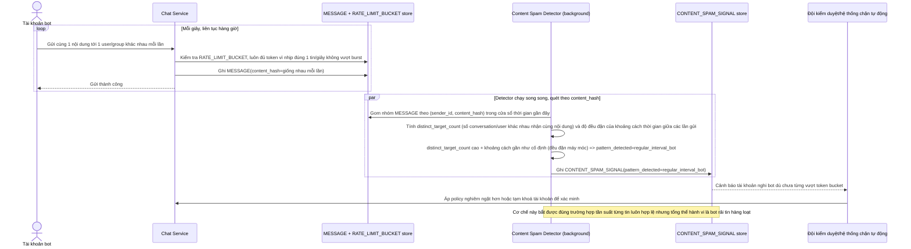

# Enhance sequence — Phát hiện bot qua nội dung lặp lại gửi tới nhiều đối tượng khác nhau

Đây là **enhance**, flow mới phát sinh từ enhance — phát hiện spam không chỉ dựa vào tần suất (vốn có thể luôn nằm dưới ngưỡng token bucket) mà còn dựa vào pattern nội dung: cùng 1 tin gửi liên tục tới nhiều group/user khác nhau trong thời gian ngắn với nhịp đều đặn máy móc. Đúng yêu cầu thứ 4 của đề bài — 1 tài khoản gửi đúng nhịp 1 tin/giây liên tục hàng giờ tới nhiều đối tượng khác nhau là dấu hiệu bot dù từng tin không vượt ngưỡng cứng.

