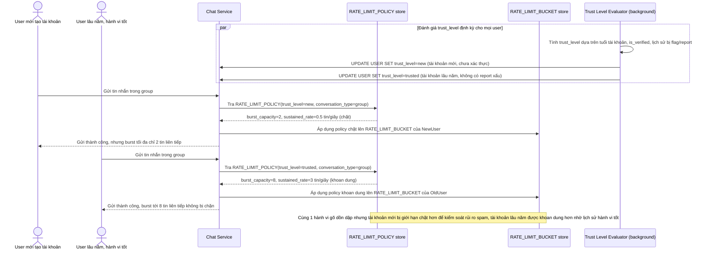

# Enhance sequence — Rate limit động theo uy tín tài khoản

Đây là **enhance**, flow mới phát sinh từ enhance — chọn `RATE_LIMIT_POLICY` áp dụng cho token bucket của mỗi user dựa trên `trust_level`, đảm bảo tài khoản mới/chưa xác thực bị giới hạn chặt hơn trong khi tài khoản lâu năm có lịch sử hành vi tốt không bị chặn quá nghiêm. Đúng yêu cầu cuối của đề bài.

