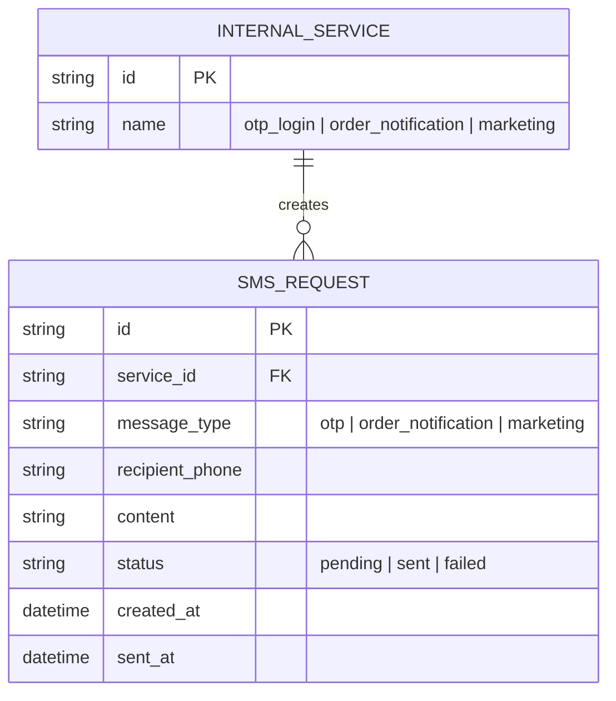

# Base ERD — Các service nội bộ tự gửi SMS/OTP trực tiếp, chưa có throttle tập trung

Đây là **base**: mô hình dữ liệu suy luận từ ngữ cảnh đề bài, thể hiện trạng thái hệ thống **trước khi** có điểm throttle outbound tập trung. Đề bài nói nhiều service nội bộ (OTP đăng nhập, thông báo đơn hàng, marketing) cùng gọi một đối tác SMS gateway bên ngoài — nên base cần đủ: các service nội bộ và các request gửi SMS mà chúng tạo ra, không phân loại ưu tiên, không có hàng đợi/TTL, không có state backoff, không có theo dõi usage. Những entity đó là phần enhance.

