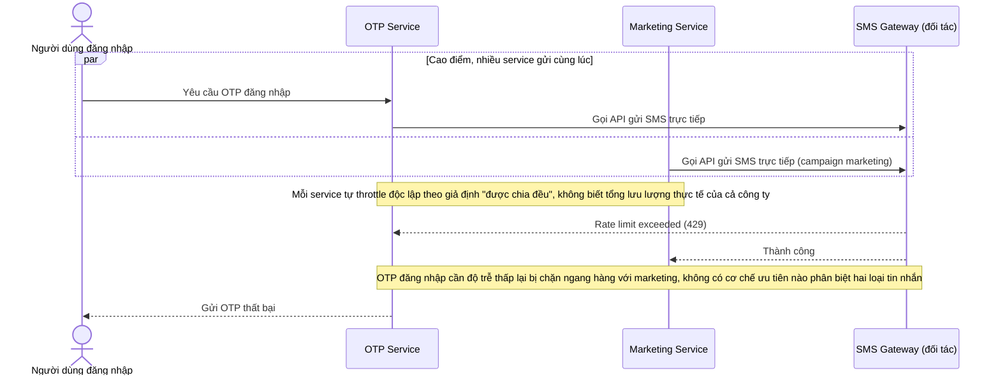

# Base sequence — Gửi SMS (mỗi service tự gọi thẳng gateway)

Đây là **base**, flow "Gửi SMS" ở trạng thái hiện tại — mỗi service nội bộ tự gọi trực tiếp API của đối tác SMS gateway, không qua bất kỳ điểm kiểm soát chung nào. Flow này liên quan mật thiết tới enhance vì toàn bộ vấn đề của đề bài (vượt giới hạn tổng, không có ưu tiên, retry dồn dập, không giám sát) đều bắt nguồn từ việc thiếu một điểm throttle tập trung ở đây.

