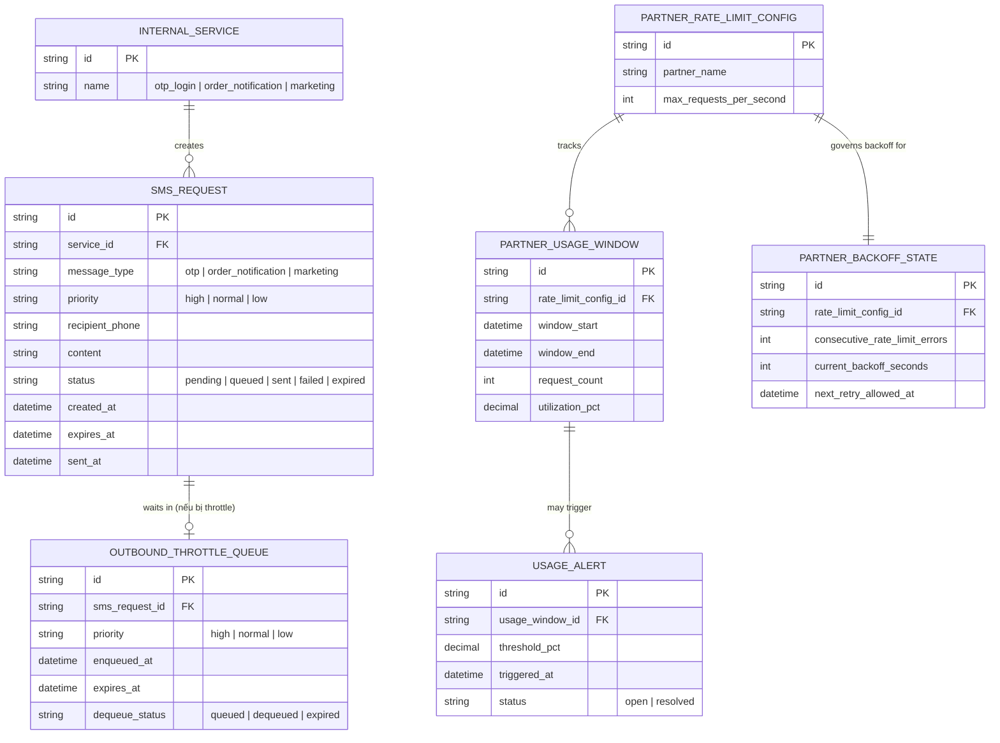

# Enhance ERD — sau khi có throttle outbound tập trung

Đây là ERD **sau khi** enhance được áp dụng lên base. So với base, có 4 nhóm entity mới, ứng trực tiếp với các yêu cầu trong đề bài:

- `SMS_REQUEST` bổ sung `priority` và `expires_at` — cơ sở để phân biệt OTP (ưu tiên cao, TTL ngắn) với marketing (ưu tiên thấp, TTL dài hơn).
- `OUTBOUND_THROTTLE_QUEUE` (mới) — hàng đợi có TTL cho request bị throttle chờ tới lượt, expire thay vì chờ vô thời hạn.
- `PARTNER_RATE_LIMIT_CONFIG` + `PARTNER_USAGE_WINDOW` (mới) — giới hạn tổng (global) của đối tác và usage thực tế theo từng window gần thời gian thực.
- `PARTNER_BACKOFF_STATE` (mới) — trạng thái backoff tăng dần khi đối tác trả lỗi rate limit.
- `USAGE_ALERT` (mới) — cảnh báo sớm khi usage tiến gần ngưỡng.

