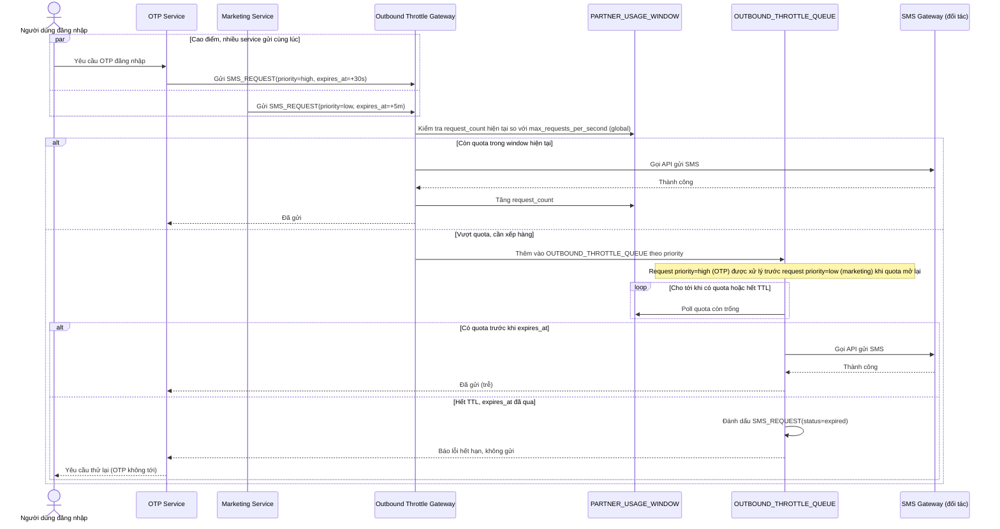

# Enhance sequence — Gửi SMS (qua throttle gateway tập trung, có ưu tiên và TTL)

Đây là **enhance** của flow "Gửi SMS" đã có ở base. So với base, mọi service không còn gọi thẳng đối tác — toàn bộ request phải đi qua một Outbound Throttle Gateway dùng chung, kiểm tra usage window global trước khi quyết định gửi ngay hay xếp hàng theo priority, và request trong hàng đợi có TTL riêng theo loại tin nhắn (đáp ứng yêu cầu 1, 2 và 4 của đề bài).

