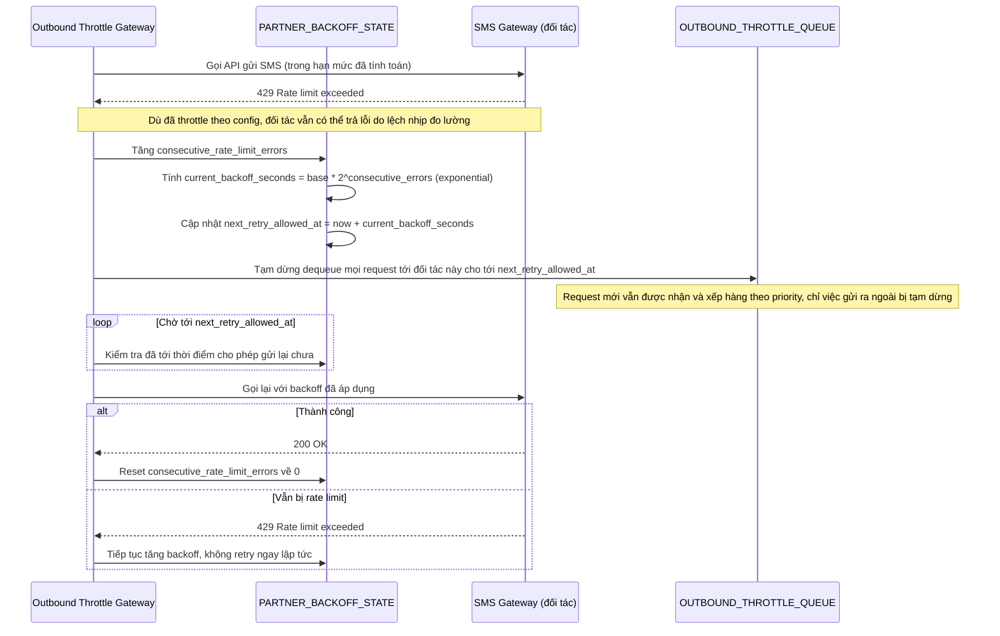

# Enhance sequence — Backoff khi đối tác trả lỗi rate limit

Đây là **enhance**, flow hoàn toàn mới, phát sinh từ enhance — chưa tồn tại ở base (base không retry có kiểm soát, không có backoff). Đáp ứng yêu cầu 3 của đề bài: khi bị đối tác trả lỗi rate limit dù đã throttle, phải backoff tăng dần thay vì retry ngay lập tức.

