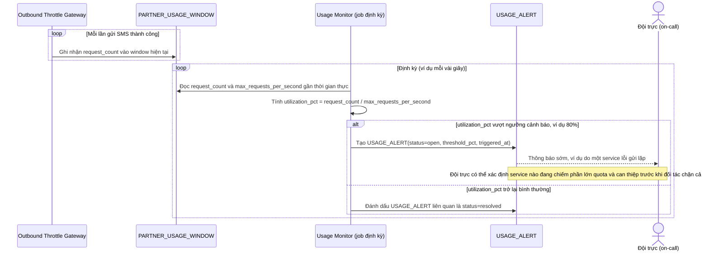

# Enhance sequence — Giám sát usage gần thời gian thực và cảnh báo sớm

Đây là **enhance**, flow hoàn toàn mới, phát sinh từ enhance — chưa tồn tại ở base (base không đo lường usage tổng, mỗi service không biết tình trạng của các service khác). Đáp ứng yêu cầu 5 của đề bài: giám sát usage thực tế so với hạn mức đối tác, cảnh báo sớm khi xu hướng traffic tiến gần ngưỡng trước khi bị chặn hoàn toàn.

