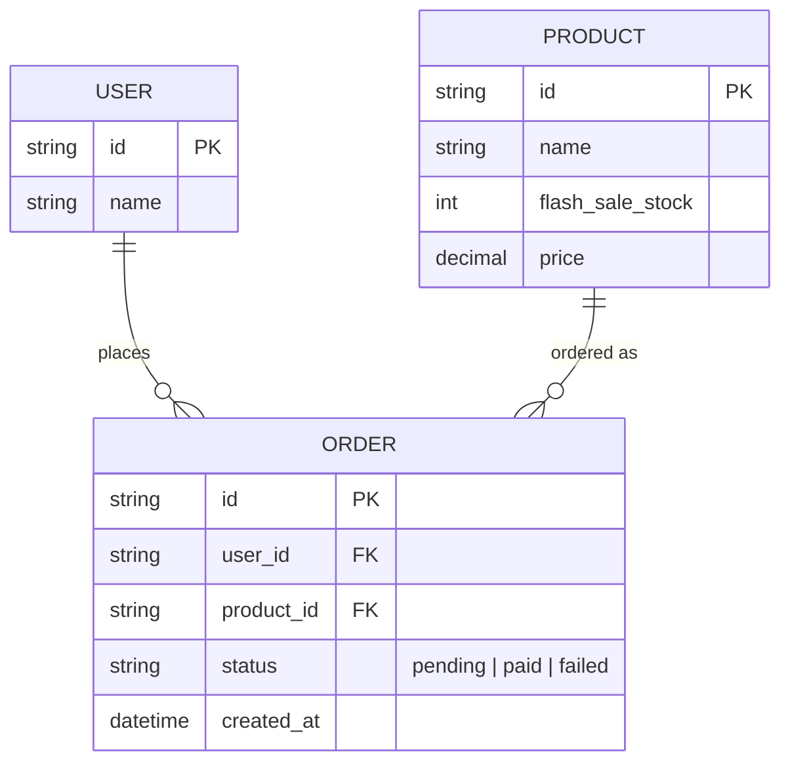

# Base ERD — Checkout gọi thẳng backend, chưa có phòng chờ

Đây là **base**: mô hình dữ liệu suy luận từ ngữ cảnh đề bài, thể hiện trạng thái hệ thống **trước khi** có throttle ở tầng vào (virtual waiting room). Đề bài nói e-commerce có flash sale với sản phẩm giới hạn số lượng, user checkout trực tiếp — nên base cần đủ: user, sản phẩm flash sale, và order được tạo ngay khi checkout, không có khái niệm hàng chờ/priority/admission token/đo throughput. Những entity đó là phần enhance.

