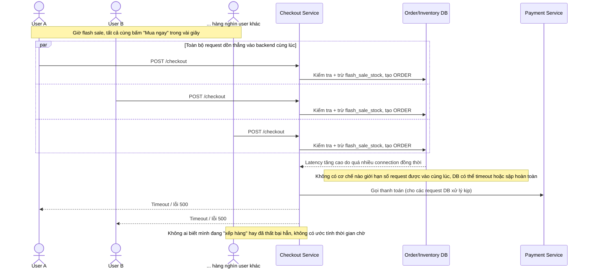

# Base sequence — Checkout (gọi thẳng backend, không có admission control)

Đây là **base**, flow "Checkout" ở trạng thái hiện tại — request đi thẳng từ client vào backend (DB, payment) không qua bất kỳ điểm kiểm soát lượng vào nào. Flow này liên quan mật thiết tới enhance vì toàn bộ vấn đề của đề bài (backend quá tải, không công bằng khi nghẽn, không đo lường được) đều bắt nguồn từ việc thiếu tầng throttle ở đây.

