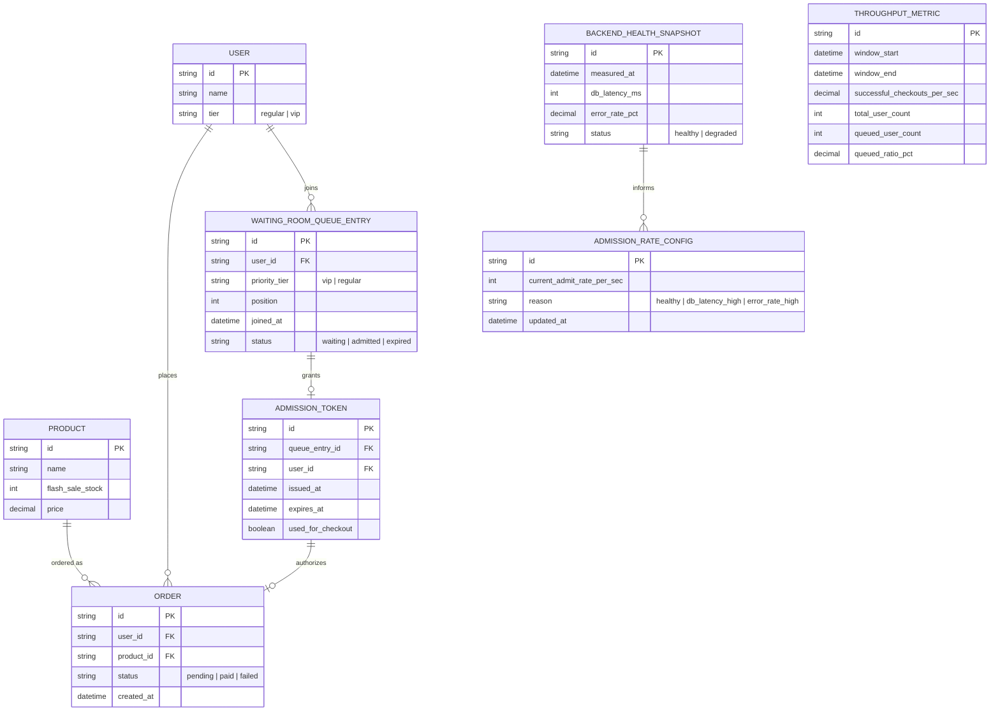

# Enhance ERD — sau khi có virtual waiting room + admission control

Đây là ERD **sau khi** enhance được áp dụng lên base. So với base, có 5 nhóm entity mới, ứng trực tiếp với các yêu cầu trong đề bài:

- `USER` bổ sung `tier` — cơ sở cho chính sách ưu tiên công bố trước (VIP) khi hàng chờ đông.
- `WAITING_ROOM_QUEUE_ENTRY` (mới) — vị trí, thời điểm vào hàng, trạng thái chờ/đã vào/hết hạn.
- `ADMISSION_TOKEN` (mới) — cấp cho user đã qua hàng chờ, dùng để checkout mà không bị throttle lại giữa đường.
- `ADMISSION_RATE_CONFIG` + `BACKEND_HEALTH_SNAPSHOT` (mới) — tốc độ cho qua hiện tại được điều chỉnh động theo sức khỏe backend thực tế, không dùng số tĩnh.
- `THROUGHPUT_METRIC` (mới) — throughput checkout thành công/giây và tỉ lệ user phải chờ, phục vụ lên kế hoạch capacity.

