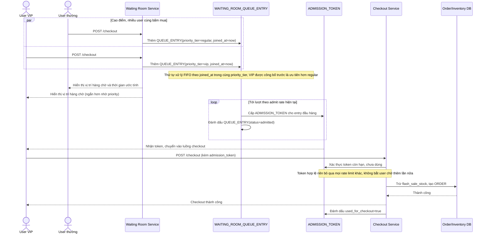

# Enhance sequence — Checkout (qua phòng chờ, admission token miễn throttle lại)

Đây là **enhance** của flow "Checkout" đã có ở base. So với base, request không còn đi thẳng vào backend — user bị chặn ở virtual waiting room theo thứ tự FIFO (trừ khi có priority tier công bố trước), chỉ khi tới lượt mới nhận admission token; sau khi cầm token, user checkout thẳng qua backend mà không bị rate limit lần nữa (đáp ứng yêu cầu 1, 2 và 4 của đề bài).

