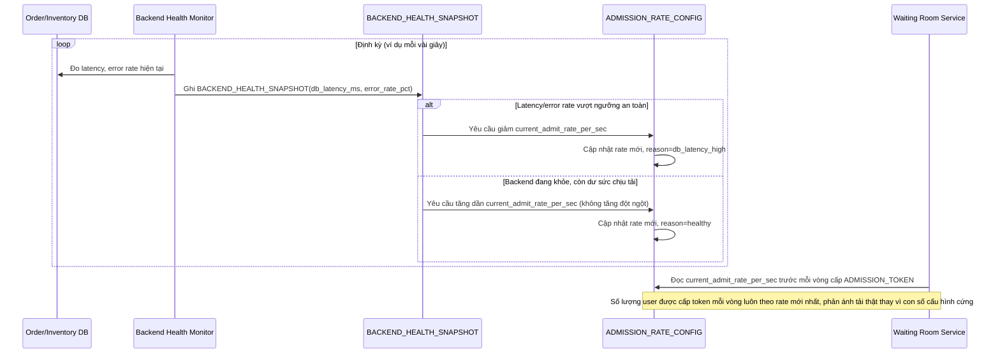

# Enhance sequence — Điều chỉnh admission rate động theo sức khỏe backend

Đây là **enhance**, flow hoàn toàn mới, phát sinh từ enhance — chưa tồn tại ở base (base không có khái niệm admit rate). Đáp ứng yêu cầu 3 của đề bài: tốc độ cho qua hàng chờ phải phản ánh tải thật của backend, không dùng số cố định tĩnh.

