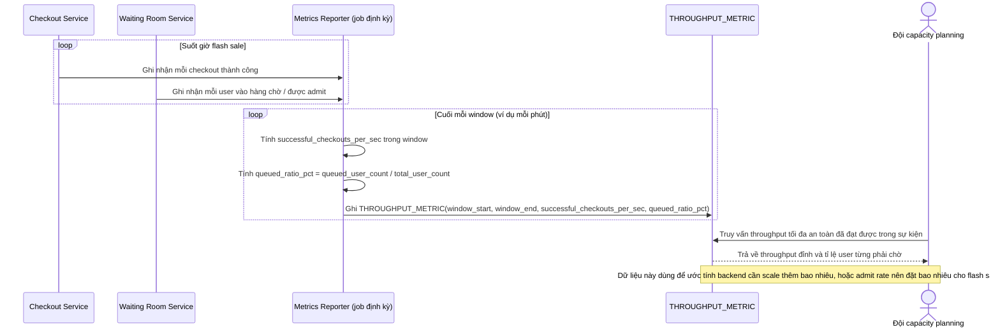

# Enhance sequence — Đo throughput và tỉ lệ user phải chờ để lên kế hoạch capacity

Đây là **enhance**, flow hoàn toàn mới, phát sinh từ enhance — chưa tồn tại ở base (base không đo lường throughput hay tỉ lệ user bị chặn). Đáp ứng yêu cầu 5 của đề bài: đo throughput checkout thành công/giây tối đa an toàn, và tỉ lệ user phải vào hàng chờ so với tổng traffic, phục vụ capacity planning cho các sự kiện sau.

