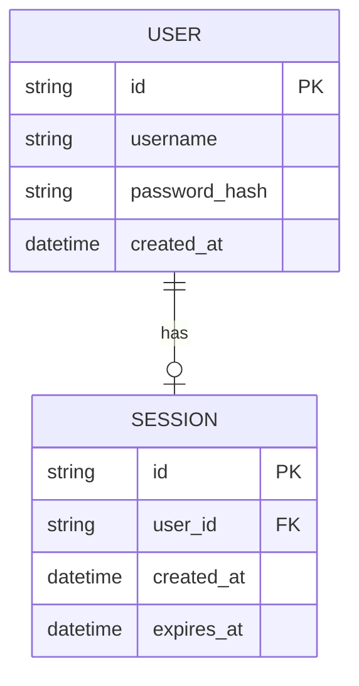

# Base ERD — Login đơn giản, chưa có rate limit

Đây là **base**: mô hình dữ liệu suy luận từ ngữ cảnh đề bài, thể hiện trạng thái hệ thống **trước khi** có rate limiting chống brute-force. Đề bài nói bảo vệ endpoint login của 1 web app — nên base cần đủ: user với credential, và session tạo ra khi login thành công. Chưa có entity nào ghi nhận lịch sử các lần login (thành công/thất bại), counter theo username/IP/device, hay cảnh báo tấn công — những thứ đó là phần enhance.

