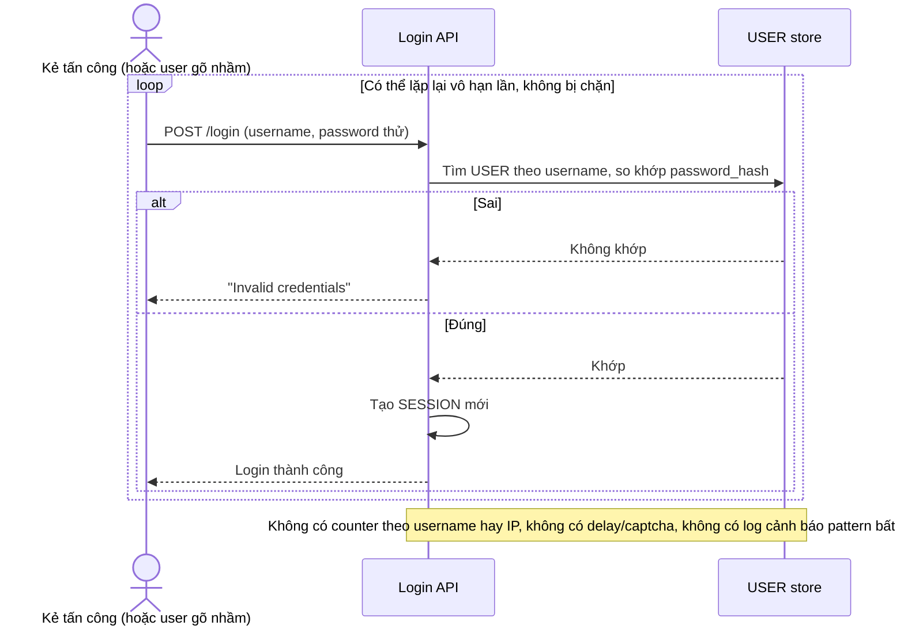

# Base sequence — Login (không giới hạn số lần thử)

Đây là **base**, flow "Login" ở trạng thái hiện tại — kiểm tra username/password, không đếm số lần sai, không phân biệt nguồn gọi. Flow này liên quan mật thiết tới enhance vì toàn bộ vấn đề của đề bài (dò mật khẩu 1 tài khoản nhiều lần, hoặc dò nhiều tài khoản từ 1 nguồn) đều khai thác đúng việc endpoint này cho thử vô hạn lần.

