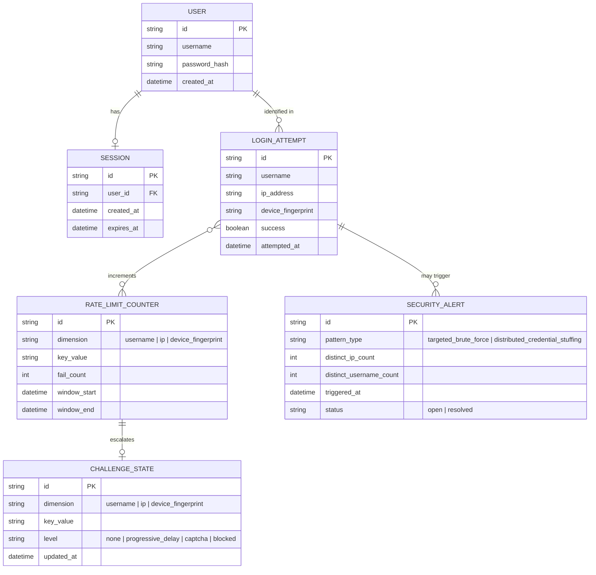

# Enhance ERD — sau khi có rate limit đa chiều chống brute-force

Đây là ERD **sau khi** enhance được áp dụng lên base. So với base, có 4 nhóm entity mới, ứng trực tiếp với các yêu cầu trong đề bài:

- `LOGIN_ATTEMPT` (mới) — ghi nhận từng lần login kèm username, IP, device fingerprint, kết quả — nền tảng để tính counter theo nhiều chiều.
- `RATE_LIMIT_COUNTER` (mới) — đếm số lần fail theo từng chiều độc lập (`username`, `ip`, `device_fingerprint`), bắt được cả tấn công 1 tài khoản lẫn tấn công rải nhiều tài khoản từ 1 nguồn.
- `CHALLENGE_STATE` (mới) — mức độ thử thách tăng dần (delay/CAPTCHA/block) gắn theo counter, thay vì chặn cứng ngay khi vượt ngưỡng.
- `SECURITY_ALERT` (mới) — cảnh báo khi phát hiện pattern tấn công rõ ràng trên diện rộng.

