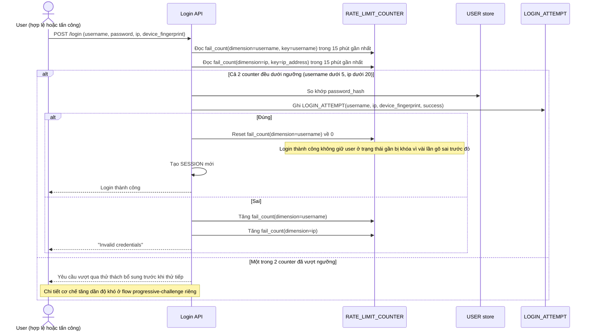

# Enhance sequence — Login (kiểm tra rate limit đa chiều, reset khi thành công)

Đây là **enhance** của flow "Login" đã có ở base. So với base, mỗi lần login đều được ghi nhận và đối chiếu với counter theo cả username lẫn IP trước khi xử lý; login thành công reset counter theo username; login sai cả username lẫn IP đều bị tăng độc lập (đáp ứng yêu cầu 1 và 4 của đề bài).

