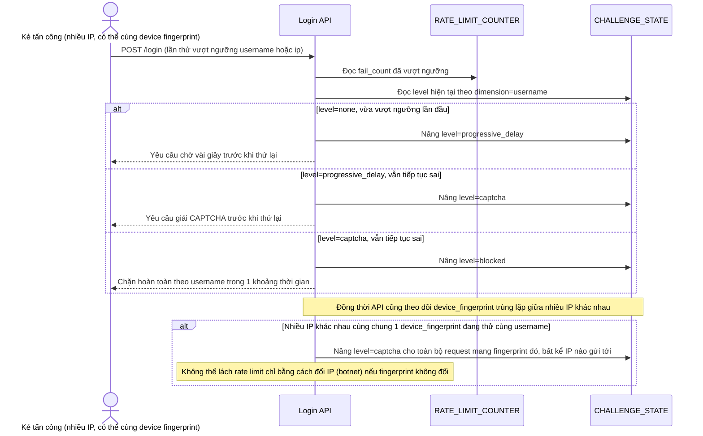

# Enhance sequence — Tăng dần độ khó khi vượt ngưỡng, kết hợp device fingerprint

Đây là **enhance**, flow hoàn toàn mới, phát sinh từ enhance — chưa tồn tại ở base (base không có khái niệm thử thách hay khóa tạm). Đáp ứng yêu cầu 2 và 3 của đề bài: không chặn cứng ngay lập tức, tăng dần progressive delay/CAPTCHA trước khi block hẳn, và không chỉ dựa vào IP đơn lẻ vì tấn công thực tế thường dùng botnet nhiều IP.

