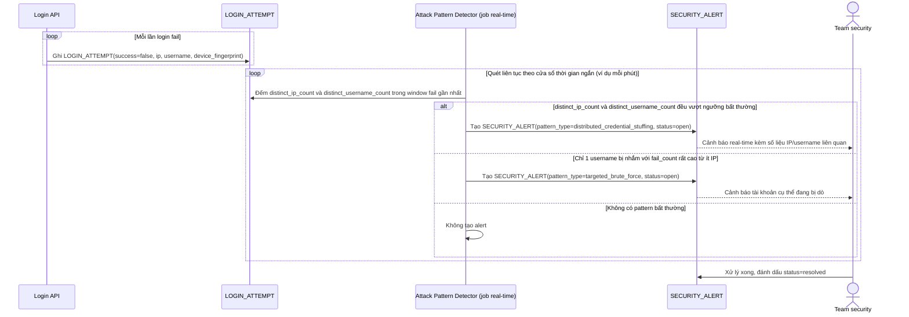

# Enhance sequence — Phát hiện pattern tấn công diện rộng, alert real-time

Đây là **enhance**, flow hoàn toàn mới, phát sinh từ enhance — chưa tồn tại ở base (base không log hay phân tích pattern của các lần login fail). Đáp ứng yêu cầu 5 của đề bài: log và alert khi phát hiện số lượng lớn login fail trong thời gian ngắn từ nhiều IP nhắm vào nhiều username, để team security theo dõi real-time.

