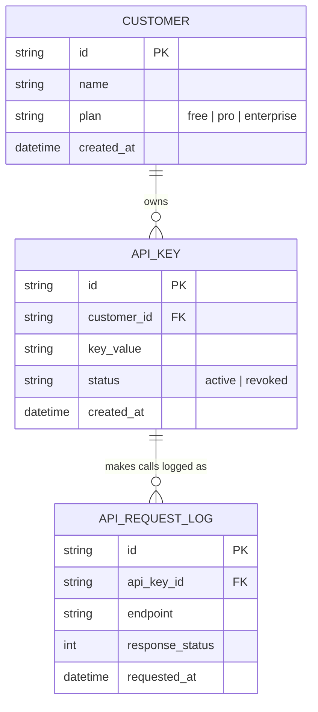

# Base ERD — API gateway forward request, log lại nhưng chưa giới hạn

Đây là **base**: mô hình dữ liệu suy luận từ ngữ cảnh đề bài, thể hiện trạng thái hệ thống **trước khi** có rate limit theo API key. Đề bài nói SaaS có khách hàng dùng API key theo gói dịch vụ (free/pro/enterprise) — nên base cần đủ: khách hàng, API key, và log các lần gọi API (phục vụ billing/analytics cơ bản), nhưng chưa có giới hạn/counter/thuật toán throttle nào, chưa có cấu hình theo gói, chưa có dashboard usage. Những entity đó là phần enhance.

