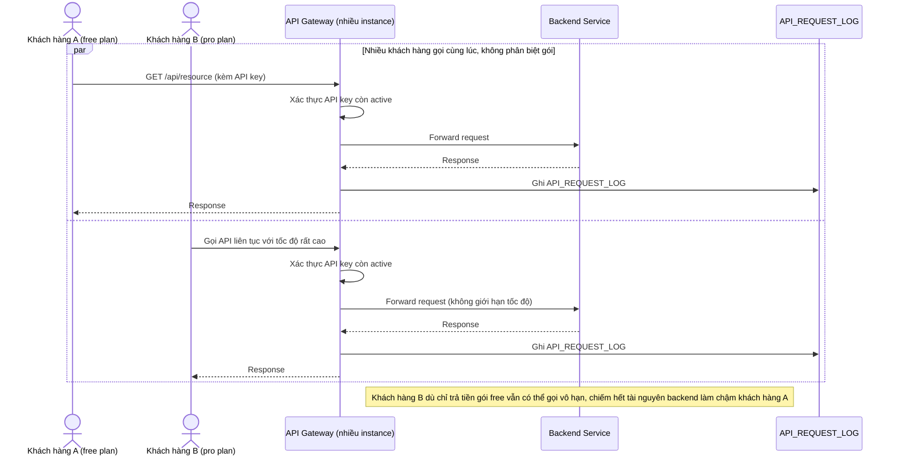

# Base sequence — Gọi API (forward thẳng, không giới hạn)

Đây là **base**, flow "Gọi API" ở trạng thái hiện tại — gateway chỉ xác thực API key còn hiệu lực rồi forward thẳng tới backend, có log lại request nhưng không đối chiếu với bất kỳ giới hạn nào. Flow này liên quan mật thiết tới enhance vì toàn bộ vấn đề của đề bài (một khách hàng dùng quá nhiều ảnh hưởng khách khác, không đúng với gói đã trả tiền) đều bắt nguồn từ việc thiếu bước kiểm tra giới hạn ở đây.

