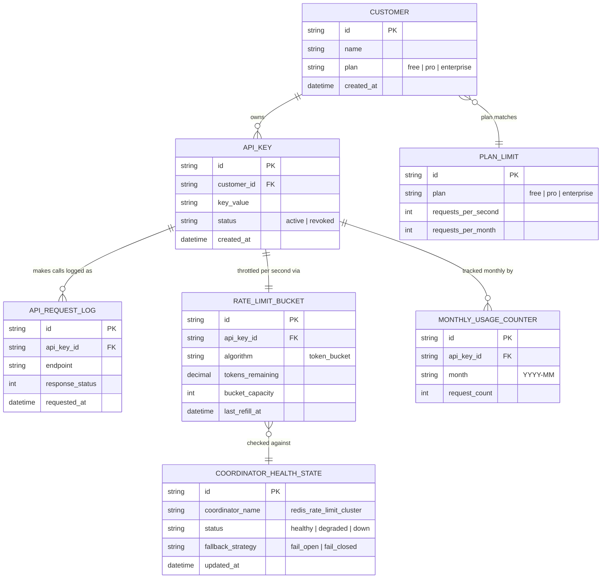

# Enhance ERD — sau khi có rate limit per-API-key, phân tán, theo gói

Đây là ERD **sau khi** enhance được áp dụng lên base. So với base, có 4 nhóm entity mới, ứng trực tiếp với các yêu cầu trong đề bài:

- `PLAN_LIMIT` (mới) — giới hạn request/giây và request/tháng cụ thể theo từng gói.
- `RATE_LIMIT_BUCKET` (mới) — trạng thái token bucket theo từng API key, lưu tập trung (Redis) để chính xác dù nhiều instance gateway chạy song song.
- `MONTHLY_USAGE_COUNTER` (mới) — đếm riêng theo tháng, độc lập với bucket giây, phục vụ cả giới hạn tháng lẫn dashboard usage.
- `COORDINATOR_HEALTH_STATE` (mới) — trạng thái Redis/coordinator và chiến lược fail-open/fail-closed khi nó chậm/down.

