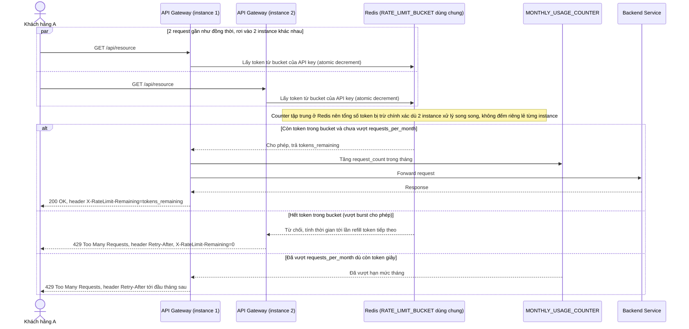

# Enhance sequence — Gọi API (token bucket dùng chung qua Redis, đúng chuẩn 429)

Đây là **enhance** của flow "Gọi API" đã có ở base. So với base, gateway không còn forward thẳng — mọi instance gateway cùng đọc/ghi chung 1 `RATE_LIMIT_BUCKET` trong Redis theo thuật toán token bucket (cho phép burst ngắn hợp lý) và kiểm tra thêm `MONTHLY_USAGE_COUNTER`, trả đúng chuẩn HTTP 429 kèm `Retry-After`/`X-RateLimit-Remaining` khi vượt (đáp ứng yêu cầu 1, 2 và 3 của đề bài).

