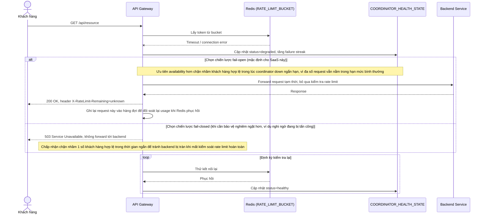

# Enhance sequence — Redis/coordinator chậm hoặc down, fail-open có kiểm soát

Đây là **enhance**, flow hoàn toàn mới, phát sinh từ enhance — chưa tồn tại ở base (base không phụ thuộc coordinator tập trung nên không có kịch bản nó down). Đáp ứng yêu cầu 4 của đề bài: khi Redis/coordinator lưu counter bị chậm/down tạm thời, phải có chiến lược rõ ràng thay vì hành vi không xác định.

