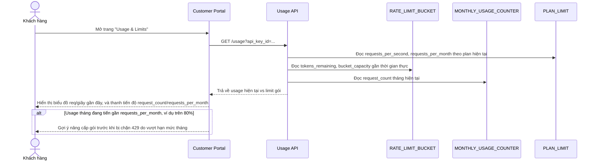

# Enhance sequence — Dashboard khách hàng tự xem usage so với limit gói

Đây là **enhance**, flow hoàn toàn mới, phát sinh từ enhance — chưa tồn tại ở base (base không có nơi nào để khách hàng xem usage vì chưa có khái niệm limit). Đáp ứng yêu cầu 5 của đề bài: khách hàng tự xem usage hiện tại so với limit gói của họ, chủ động nâng cấp trước khi bị chặn.

