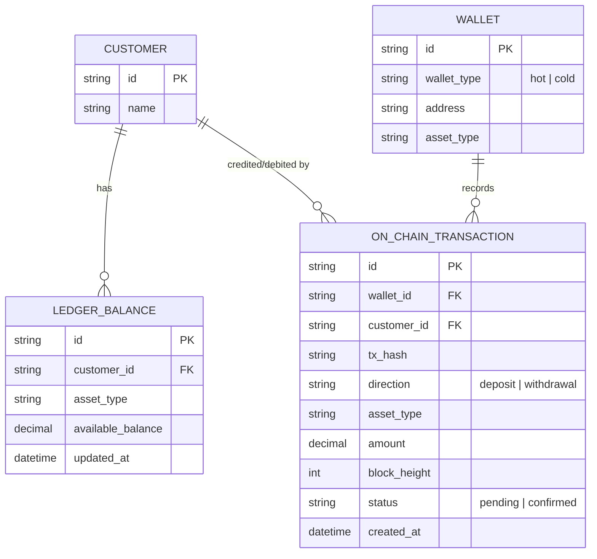

# Base ERD — Ví on-chain và ledger nội bộ, chưa có đối soát

Đây là **base**: mô hình dữ liệu suy luận từ ngữ cảnh đề bài, thể hiện trạng thái hệ thống **trước khi** có quy trình đối soát định kỳ. Đề bài nói sàn giữ tài sản khách hàng trong ví on-chain (nóng/lạnh) và duy trì ledger nội bộ ghi số dư khả dụng — nên base cần đủ: khách hàng, ví, giao dịch on-chain (nạp/rút) và số dư ledger được cập nhật từ các giao dịch đó. Chưa có entity nào phục vụ đối soát (snapshot theo block height, phát hiện sai lệch, cảnh báo khẩn, báo cáo proof-of-reserves) hay xử lý RBF/fork — những thứ đó là phần enhance.

