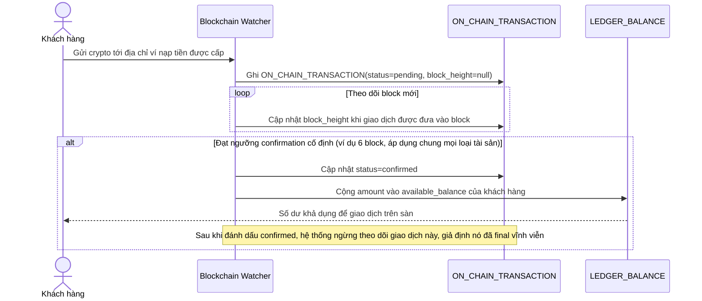

# Base sequence — Xử lý nạp tiền on-chain (ngưỡng confirmation cố định, không theo dõi sau khi confirm)

Đây là **base**, flow "Xử lý nạp tiền" ở trạng thái hiện tại — hệ thống chờ một ngưỡng confirmation cố định chung cho mọi loại tài sản rồi cộng ngay vào ledger, không theo dõi tiếp giao dịch sau khi đã coi là "confirmed". Flow này liên quan mật thiết tới enhance vì đây chính là nguồn dữ liệu (ON_CHAIN_TRANSACTION, LEDGER_BALANCE) mà đối soát sẽ đọc và so khớp, và là nơi tồn tại lỗ hổng RBF/fork mà đề bài yêu cầu xử lý.

