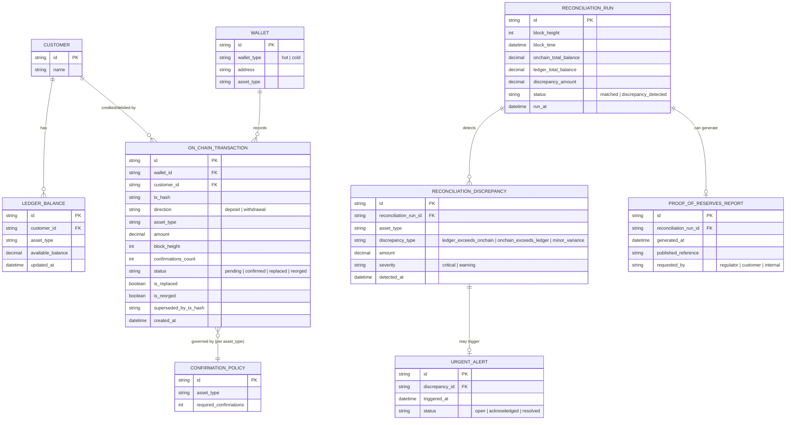

# Enhance ERD — sau khi có đối soát định kỳ ví on-chain vs ledger

Đây là ERD **sau khi** enhance được áp dụng lên base. So với base, có 5 nhóm thay đổi, ứng trực tiếp với các yêu cầu trong đề bài:

- `ON_CHAIN_TRANSACTION` bổ sung `confirmations_count`, `is_replaced`, `is_reorged`, `superseded_by_tx_hash` — phân biệt rõ pending/confirmed và phát hiện giao dịch bị RBF/đảo do fork.
- `CONFIRMATION_POLICY` (mới) — ngưỡng xác nhận an toàn riêng theo từng loại tài sản, thay cho ngưỡng cố định chung.
- `RECONCILIATION_RUN` (mới) — 1 lần đối soát tại 1 block height/thời điểm xác định, so khớp tổng on-chain với snapshot ledger cùng thời điểm.
- `RECONCILIATION_DISCREPANCY` (mới) — sai lệch phát hiện được, phân loại mức độ nghiêm trọng.
- `URGENT_ALERT` (mới) — cảnh báo khẩn khi ledger vượt tài sản thực, không chờ lịch định kỳ.
- `PROOF_OF_RESERVES_REPORT` (mới) — báo cáo minh bạch cho khách hàng/cơ quan quản lý.

