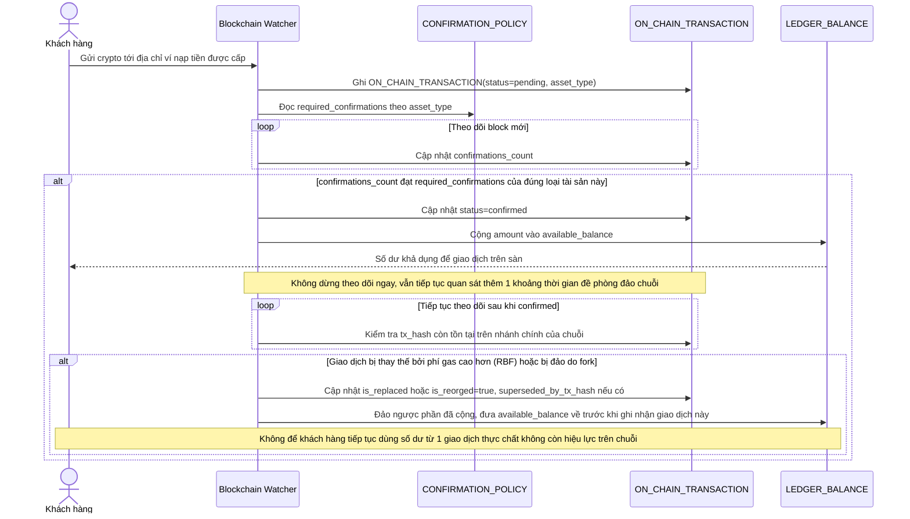

# Enhance sequence — Xử lý nạp tiền on-chain (ngưỡng theo tài sản, theo dõi RBF/fork sau khi confirm)

Đây là **enhance** của flow "Xử lý nạp tiền" đã có ở base. So với base, ngưỡng confirmation không còn cố định chung mà tra theo `CONFIRMATION_POLICY` của từng loại tài sản, và hệ thống tiếp tục theo dõi giao dịch ngay cả sau khi đã confirmed để phát hiện bị thay thế (RBF) hoặc đảo do fork, đảo ngược lại phần đã cộng ledger nếu cần (đáp ứng yêu cầu 2 và 4 của đề bài).

