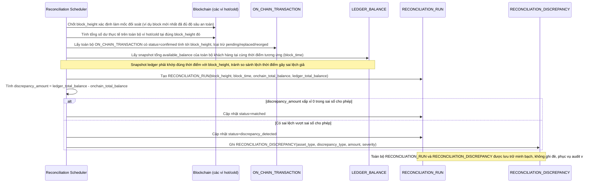

# Enhance sequence — Đối soát định kỳ ví on-chain vs ledger nội bộ

Đây là **enhance**, flow hoàn toàn mới, phát sinh từ enhance — chưa tồn tại ở base (base không có bước so khớp tổng tài sản). Đáp ứng yêu cầu 1 và 2 của đề bài: tính đúng số dư on-chain tại 1 block height xác định, so khớp với snapshot ledger cùng thời điểm, chỉ tính giao dịch đã confirmed (loại trừ pending).

