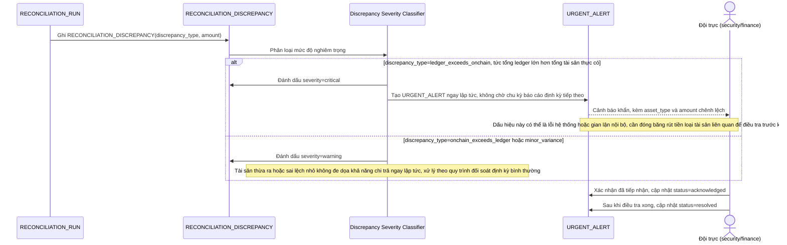

# Enhance sequence — Cảnh báo khẩn khi ledger vượt tài sản thực on-chain

Đây là **enhance**, flow hoàn toàn mới, phát sinh từ enhance — chưa tồn tại ở base (base không có cơ chế phát hiện hay cảnh báo sai lệch). Đáp ứng yêu cầu 3 của đề bài: phát hiện ledger nội bộ vượt quá tài sản thực trên ví on-chain (dấu hiệu nghiêm trọng) và cảnh báo khẩn ngay lập tức, không chờ báo cáo đối soát định kỳ theo lịch thông thường.

